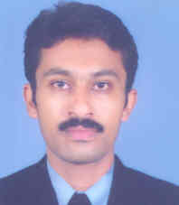

# H. Khalid Rafi
  
Roll No: MM08D002  
Jointly guided by Prof. K. Prasad Rao   
Thesis title: Studies on solid state coatings by friction surfacing   
Rafi defended thesis on May 31, 2011.   
Currently Rafi is doing his post-doctoral research with Dr. Brent Stucker in Utah on additive manufacturing.
Rafi's work started the area of friction surfacing in the lab. His thesis has led to a number of publications as listed below.

## Journal Publications

  -  Microstructural evolution during friction surfacing of austenitic stainless steel AISI 304 on low carbon steel   
Khalid Rafi, H., Kishore Babu, N., Phanikumar, G., Prasad Rao, K.    
Metallurgical and Materials Transactions A, Vol. 44, Issue 1, pp. 345-350, (2013)   
[DOI](http://dx.doi.org/10.1007/s11661-012-1366-3)
  - Corrosion Resistance of Friction Surfaced AISI 304 Stainless Steel Coatings   
Khalid Rafi, H., Phanikumar, G., Prasad Rao, K.   
Journal of Materials Engineering and Performance,  (2012)  
[DOI](http://dx.doi.org/10.1007/s11665-012-0270-8)
  - Thermal Profiling Using Infrared Thermography in Friction Surfacing   
H. Khalid Rafi, Krishnan Balasubramaniam, G. Phanikumar and K. Prasad Rao   
Metallurgical and Materials Transactions A, OnLine First, 09-June-2011 (2011)   
[DOI](http://dx.doi.org/10.1007/s11661-011-0750-8)
  - Material Flow Visualization during Friction Surfacing   
H. Khalid Rafi, G. Phanikumar and K. Prasad Rao   
Metallurgical and Materials Transactions A, Vol. 42, No. 4, Pages 937-939 (2011)   
[DOI](http://dx.doi.org/10.1007/s11661-011-0614-2)
  - Microstructural evolution during friction surfacing of tool steel H13   
Rafi, H.K., Ram, G.D.J., Phanikumar, G., Rao, K.P.   
Materials and Design, vol. 32(1), pp. 82-87 (2011)   
[DOI](http://dx.doi.org/10.1016/j.matdes.2010.06.031)

